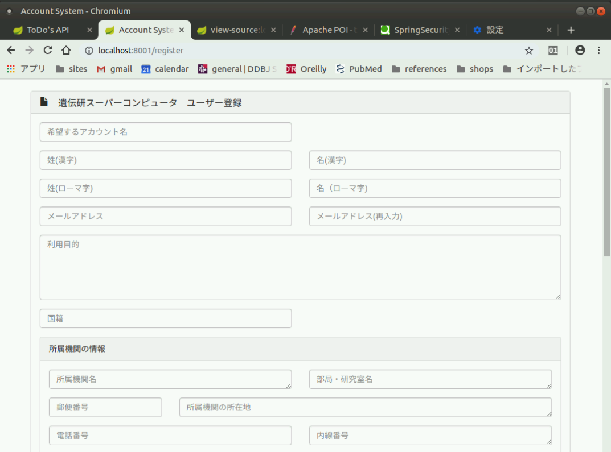
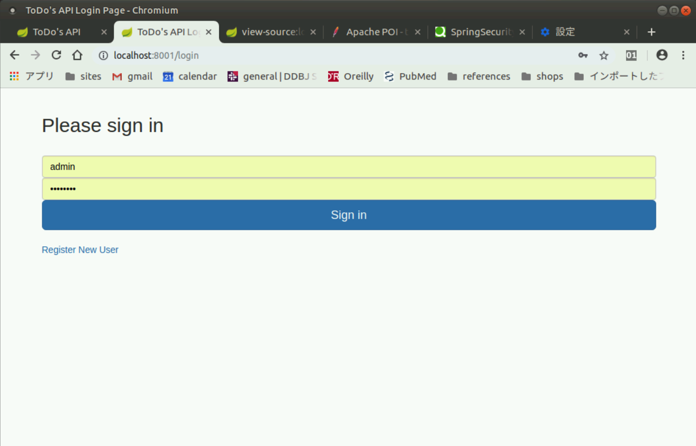
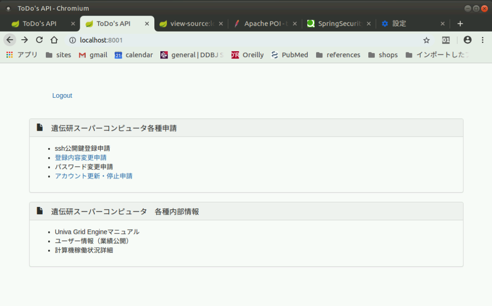
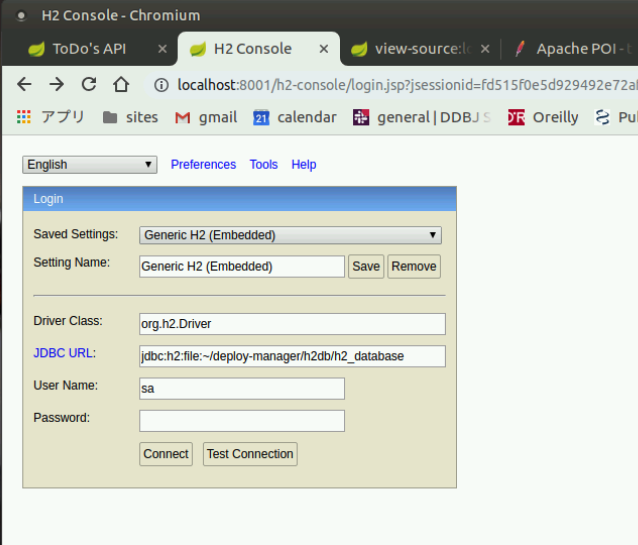

# ddbj-account-webui

## 機能概略の記載

目的と、実装したい機能の概略は以下に記載したのでそちらを参照のこと。

- [https://gitlab.ddbj.nig.ac.jp/oogasawa/ddbj-user-accounts](https://gitlab.ddbj.nig.ac.jp/oogasawa/ddbj-user-accounts)

## 使い方

git cloneのやり方は[labnote-git-how-to](https://gitlab.ddbj.nig.ac.jp/oogasawa/labnote-git-how-to)
を参照のこと。OAuth2で認証するので。

動作環境

- OpenJDK11
- Apache Maven 3.x

コンパイル方法

git cloneしたら以下を実行する。

    mvn compile package

実行方法

    java -Dserver.port=8001 -jar target/ddbj-account-webui-VERSION.jar
    
- `~/deploy-manager/`ディレクトリの下にデータベースが作られる。

## Web UI

新規ユーザー登録画面 : ログインは不要

ログイン画面

ログイン後の画面

H2データベース管理画面(Admin権限要)

## version履歴

semantic versioningでバージョンをつけてtagを振ってあるので、以下のようにして特定バージョンのコードを取り出すことができます。

    git checkout タグ名

- v0.4.0
    - JDBC Authentication + スパコンユーザー登録（データベースにデータを入れる）機能の最も単純なプログラム。基本的な動きの確認のみ。
    - 動作はまだ見直す必要がある。(`jp.ac.nig.ddbj.account.config.SpringSecurityConfig`をまだいじる必要があるがとりあえず関係者に公開する。)

- v0.3.0
    - JDBC Authenticationでログインする最も単純なプログラム。基本的な動きの確認のみ。

- v0.2.0
    - クラス名を調整した。

- v0.1.0
    -  [ユーザーアカウント登録フォームの作成 : 20190219](/notes/notes_201902/note_0219_001_meeting/note.md)
        - Spring Boot 2 + Spring Security 5 + bootstrap 3で実装することにした。
        - version 0.1.0ではSpring Securityを使っているがユーザーの認証情報はプログラム中にハードコードされている。スパコンユーザー登録画面の設計と画面遷移の基本的な動きの確認のみの単純なプログラムとなっている。
        - スパコンユーザーの登録フォームと画面遷移を作成した。画面遷移ではなりすましに気をつける。
        - one-jarですべて事が済みインストール、運用が楽になるようにする。
        - TODO: 本運用ではJDBCで認証するが、SAML, OAuth2認証に対応してSingle Sign Onを実現したい。googleアカウントでログインできると良い。
        - TODO: 運用が楽になるように、DBMSはH2 Databaseで実装したい。
        - TODO: 本人IDを内部に持つ。これは管理者だけが見えるようにする。ユーザーに対してはスパコンアカウントまたはメールアドレスがIDとなる。

- version 0.1.0以前の作業
    - [IDMの調査（藤澤さん) : 20190213](/notes/notes_201902/note_0213_001_IDM/)
    - [ユーザーアカウント登録フォームの設計 : 20190213](/notes/notes_201902/note_0213_002_Forms/)
        - とりあえず現行のスパコンアカウント登録ページなどをPDFで保存した。設計はまだしていない。

## 参考

- [Pro Spring Boot2 (Apress, 2018)](https://learning.oreilly.com/library/view/pro-spring-boot/9781484236765/html/340891_2_En_8_Chapter.xhtml)
- [Spring 5.0 Microservices, 2nd ed. (Packet Publishing, 2017)](https://learning.oreilly.com/library/view/spring-50-microservices/9781787127685/)
- [Pro Spring MVC (Apress, 2012)](https://learning.oreilly.com/library/view/pro-spring-mvc/9781430241553/Chapter02.html)
- [Pro Spring 5, 5th ed. (Apress, 2017)](https://learning.oreilly.com/library/view/pro-spring-5/9781484228081/)
- [Pro Spring Security, (Apress, 2013)](https://learning.oreilly.com/library/view/pro-spring-security/9781430248187/)
- [Spring Security 3.1 (Pucket Publishing, 2012)](https://learning.oreilly.com/library/view/spring-security-31/9781849518260/)
- [Spring Security authentication using locally stored H2 database.(2018)](http://www.virtual7.de/blog/2018/04/spring-security-authentication-using-locally-stored-h2-database/)
- [H2 Database Engine | Official Site](http://www.h2database.com/html/main.html)
- [Securing the Perimeter: Deploying Identity and Access Management with Free Open Source Software (Apress, 2018)](https://learning.oreilly.com/library/view/securing-the-perimeter/9781484226018/)  